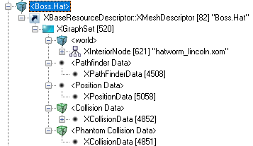

# Worms 3D Kerfuffle

This page contains my efforts to create a Worms 3D mod I call Worms 3D Kerfuffle.
You can download the latest version here: https://gnt4.online/w3dk/

## Text Modification

You can find all of the game text in `files/Language`. It looks like the developers originally created
csv files, such as `NGCMessages.csv`, and then converted them to XOM objects in the `files/Language/NGC`
directory. You therefore can modify these messages by modifying the respective XOM object, such as `American.xom`.


## Weapon Modification

This section details my efforts to find where weapon damage is set. If you'd prefer to avoid the technical parts,
skip to the next section.

Health is set at instruction 0x80140f3c in the `main.dol`.
If a worm has taken damage, the damage will be set to `worm->new_health` (offset 0x24).

Damage is subtracted from total health at instruction 0x80149598. Damage is set at 0x80148f3c which is passed in as the
second parameter of the function starting at 0x80148e8c.

Damage is calculated at the function at 0x80143bdc, which will be called `calculate_damage`.
Later decomp efforts showed this function to actually be `HandleMessage__15WormLogicEntityPC7Message`
Blast damage is calculated at the function at 0x80148a58, which will be called `calculate_blast_damage`.
Somewhere in these functions, it must account for the weapon being used. Let's start by just looking at Fire Punch,
which appears to always do 30 damage. The 30 must be stored somewhere we can modify.

Unfortunately, the call stack above this point looks like this code is determined via an interpreter of some sort.
After [doing some research](https://t17forum.worms2d.info/index.php/t-39070.html), I can see that it is interpreted
from XOM files.

### WeapTwk.xom

This file contains most of the weapon data, and appears to be easy to configure after conversion with
[Xom2Xml](https://github.com/AlexBond2/Xom2Xml). For example, here is data for fire punch:

```xml
    <MeleeWeaponPropertiesContainer id="kWeaponFirePunch-0">
      <IsAimedWeapon>false</IsAimedWeapon>
      <DamageIsPercentage>false</DamageIsPercentage>
      <WormIsWeapon>true</WormIsWeapon>
      <RetreatTimeOverride>0</RetreatTimeOverride>
      <Radius>8</Radius>
      <MinAimAngle>0</MinAimAngle>
      <MaxAimAngle>0</MaxAimAngle>
      <DischargeFX></DischargeFX>
      <DischargeSoundFX></DischargeSoundFX>
      <WormCollisionFX>WeaponFirePunch</WormCollisionFX>
      <LandCollisionFX></LandCollisionFX>
      <LogicalPositionOffset x="16" y="0" z="4"/>
      <ImpulseDirection x="70" y="0" z="0"/>
      <LogicalLaunchYOffset>-8</LogicalLaunchYOffset>
      <WormDamageMagnitude>30</WormDamageMagnitude>
      <LandDamageMagnitude>0</LandDamageMagnitude>
      <ImpulseMagnitude>0.22</ImpulseMagnitude>
      <WormDamageRadius>0</WormDamageRadius>
      <LandDamageRadius>0</LandDamageRadius>
      <ImpulseRadius>0.1</ImpulseRadius>
      <DisplayName>Text.kWeaponFirePunch</DisplayName>
      <AnimDraw>DrawFirepunch</AnimDraw>
      <AnimAim>HoldFirepunch</AnimAim>
      <AnimFire>FireFirepunch</AnimFire>
      <AnimHolding></AnimHolding>
      <AnimEndFire></AnimEndFire>
      <WeaponGraphicsResourceID>Dummy</WeaponGraphicsResourceID>
      <WeaponType>0</WeaponType>
      <DefaultPreference>0</DefaultPreference>
      <CurrentPreference>0</CurrentPreference>
      <LaunchDelay>300</LaunchDelay>
      <PostLaunchDelay>0</PostLaunchDelay>
      <FirstPersonOffset x="0" y="0" z="0"/>
      <FirstPersonScale x="0" y="0" z="0"/>
      <FirstPersonFiringParticleEffect></FirstPersonFiringParticleEffect>
      <FirstPersonDrawAnim></FirstPersonDrawAnim>
      <FirstPersonWindUpAnim></FirstPersonWindUpAnim>
      <FirstPersonFireAnim></FirstPersonFireAnim>
      <FirstPersonWindDownAnim></FirstPersonWindDownAnim>
      <FirstPersonReloadAnim></FirstPersonReloadAnim>
      <FirstPersonHideAnim></FirstPersonHideAnim>
      <FirstPersonIdleAnim></FirstPersonIdleAnim>
      <FirstPersonHandDrawAnim></FirstPersonHandDrawAnim>
      <FirstPersonHandWindUpAnim></FirstPersonHandWindUpAnim>
      <FirstPersonHandFireAnim></FirstPersonHandFireAnim>
      <FirstPersonHandWindDownAnim></FirstPersonHandWindDownAnim>
      <FirstPersonHandReloadAnim></FirstPersonHandReloadAnim>
      <FirstPersonHandHideAnim></FirstPersonHandHideAnim>
      <FirstPersonHandIdleAnim></FirstPersonHandIdleAnim>
      <DisplayInFirstPerson>false</DisplayInFirstPerson>
      <CanBeFiredWhenWormMoving>true</CanBeFiredWhenWormMoving>
      <RumbleLight>0</RumbleLight>
      <RumbleHeavy>150</RumbleHeavy>
    </MeleeWeaponPropertiesContainer>
```

Some enum values can be found matching to [Worms Ultimate Mayhem](https://github.com/AlexBond2/Xom2Xml/blob/main/XOMSCHM/WUM/XEnum.md).

Weapon damage is determined by this entry:

```xml
<WormDamageMagnitude>30</WormDamageMagnitude>
```

Here is an example of modifying this value to 100:


## Campaign Modification

Each campaign level seems to have its own lua file, making modification incredibly simple.
The first campaign level, D-Day, has the file `files/Scripts/dday.lua`. Here's an example
of the definition of an enemy worm:

```lua
   -- Worm 6, Team 1
   CopyContainer("Worm.Data04", "Worm.Data06")
   lock, worm = EditContainer("Worm.Data06")
   CopyContainer("AIParams.Worm04", "AIParams.Worm06")
   worm.Energy = 30  
   worm.Spawn = "spawn7"
   worm.Name = "Scutze"
   CloseContainer(lock)
```

You can easily change things like the name of the worm:


## Challenge Modification

The first challenge, Shotgun Challenge 1, can be found in the file `files/Scripts/TargetHunt.lua`.
Any lua files are trivial to modify, so for this challenge I changed it from having only the
shotgun to having all weapons from the D-Day campaign:

So I changed the inventory from:

```lua
function SetupInventories()
   -- sets up a default container and adds our selection to it
   lock, inventory = EditContainer("Inventory.Team.Default") 
   inventory.Shotgun = -1
   CloseContainer(lock) -- must close the container ASAP

   CopyContainer("Inventory.Team.Default", "Inventory.Team00")
   CopyContainer("Inventory.Team.Default", "Inventory.Team01")

   lock, delays = EditContainer("Inventory.WeaponDelays") 
   CloseContainer(lock)

end
```

to:

```lua
function SetupInventories()
   -- sets up a default container and adds our selection to it
   lock, inventory = EditContainer("Inventory.Team.Default") 
   inventory.Bazooka = -1
   inventory.Grenade = -1
   inventory.ClusterGrenade = 5
   inventory.Uzi = -1
   inventory.Landmine = 5
   inventory.FirePunch = -1
   inventory.Shotgun = -1
   inventory.SkipGo = -1
   
   CloseContainer(lock) -- must close the container ASAP

   -- Copies this selection into each worm

   CopyContainer("Inventory.Team.Default", "Inventory.Team00")
   CopyContainer("Inventory.Team.Default", "Inventory.Team01")

   -- Sets allies to have extra airstrikes and no clusters
   lock, inventory = EditContainer("Inventory.Team00") 
   inventory.Airstrike = 1
   inventory.ClusterGrenade = 0
   inventory.Mortar = 4
   inventory.Landmine = 0
   inventory.HomingMissile = 1
   --inventory.FlameThrower = 2
   inventory.Girder = 0

   CloseContainer(lock)
   lock, inventory = EditContainer("Inventory.Team01") 
   
    inventory.HomingMissile = 0
   
    CloseContainer(lock)
   
   -- Sets up some delays
   lock, delays = EditContainer("Inventory.WeaponDelays") 
   delays.Airstrike = 4
   CloseContainer(lock)
end
```

And you can see the results here:


## Skip Intro Cutscenes

The method `main()` is at 0x8015b1a8, so the calls to the cutscenes should be somewhat early in that method.
But upon further inspection, main appears to jump to interpreted code fairly early on. A better way of finding
the intro video cutscene definitions might be to search for the video titles.

Turns out it's even easier than that, you can simply delete or rename `files/FMV/NTSC/acclaim.thp` and
`files/FMV/NTSC/t17logo.thp` to remove them from the intro. The MusyX splash screen is a combination of
static images though. Specifically it's a combination of:

- `files/Logos/License.tga`
- `files/Frontend/Icons/musyxdolby.tga`
- `files/Logos/musyxdolbytext.tga`

These three are defined in `files/Bundles/bundle03.xom`. They're actually the only things defined in bundle03.
To modify them, you must modify them **in** bundle03.xom, not the file paths under `Logos/` and `Frontend/`.
The file bundle03.xom unfortunately cannot be renamed or deleted without causing runtime errors.

If we look at the file load order:

```
23:03:603 Core\HW\DVD\FileMonitor.cpp:86 W[FileMon]:      67 kB Local.xom
23:03:792 Core\HW\DVD\FileMonitor.cpp:86 W[FileMon]:       9 kB DefSave.xom
23:03:903 Core\HW\DVD\FileMonitor.cpp:86 W[FileMon]:      13 kB Tweak.xom
23:04:044 Core\HW\DVD\FileMonitor.cpp:86 W[FileMon]:      20 kB WeapTwk.xom
23:04:158 Core\HW\DVD\FileMonitor.cpp:86 W[FileMon]:      96 kB MenuTwk.xom
23:04:365 Core\HW\DVD\FileMonitor.cpp:86 W[FileMon]:       6 kB CamTwk.xom
23:04:492 Core\HW\DVD\FileMonitor.cpp:86 W[FileMon]:      18 kB Scripts.xom
23:04:612 Core\HW\DVD\FileMonitor.cpp:86 W[FileMon]:       7 kB HudTwk.xom
23:04:720 Core\HW\DVD\FileMonitor.cpp:86 W[FileMon]:       8 kB LvlSetup.xom
23:04:837 Core\HW\DVD\FileMonitor.cpp:86 W[FileMon]:       1 kB Persist.xom
23:04:945 Core\HW\DVD\FileMonitor.cpp:86 W[FileMon]:      12 kB AITwk.xom
23:05:102 Core\HW\DVD\FileMonitor.cpp:86 W[FileMon]:      17 kB MenuTwkGC.xom
23:05:267 Core\HW\DVD\FileMonitor.cpp:86 W[FileMon]:     192 kB PartTwk.xom
23:05:481 Core\HW\DVD\FileMonitor.cpp:86 W[FileMon]:     244 kB Language/NGC/American.xom
23:05:768 Core\HW\DVD\FileMonitor.cpp:86 W[FileMon]:     588 kB Bundles/bundle05.xom
23:06:330 Core\HW\DVD\FileMonitor.cpp:86 W[FileMon]:     138 kB Bundles/bundle03.xom
23:07:125 Core\HW\DVD\FileMonitor.cpp:86 W[FileMon]:       7 kB Audio/NGCSFX/NGCSFX.pool
23:08:542 Core\HW\DVD\FileMonitor.cpp:86 W[FileMon]:       1 kB Audio/NGCSFX/NGCSFX.proj
23:08:543 Core\HW\DVD\FileMonitor.cpp:86 W[FileMon]:   2,400 kB Audio/NGCSFX/NGCSFX.samp
23:09:586 Core\HW\DVD\FileMonitor.cpp:86 W[FileMon]:      10 kB Audio/NGCSFX/NGCSFX.sdir
23:09:705 Core\HW\DVD\FileMonitor.cpp:86 W[FileMon]:      18 kB Bundles/Bundle02.xom
23:13:815 Core\HW\DVD\FileMonitor.cpp:86 W[FileMon]:   2,903 kB FMV/NTSC/acclaim.thp
23:23:986 Core\HW\DVD\FileMonitor.cpp:86 W[FileMon]:   2,075 kB FMV/NTSC/t17logo.thp
```

bundle05.xom seems to have icons, the loading animation, boxes, buttons, and bars. So mostly UI.
Looks like bundle03.xom is loaded from the DOL most likely, will be easier to remove at a later time.
For now, just override the existing images with some mod related info.

## Unlock Levels by Default

The file `DefSave.xom` contains metadata on which files are locked by default. You can force it to be
unlocked by default by removing a locked entry like so:

```xml
  <ContainerResources href="L.L.Leek"/>
  ...
  <XContainerResourceDetails id="L.L.Leek">
    <Value href="L.L.Leek-0"/>
    <Name>L.L.Leek</Name>
    <Flags>17</Flags>
  </XContainerResourceDetails>
  <LockedContainer id="L.L.Leek-0">
    <Locked>true</Locked>
    <LockedTitle>Text.Level.Leek</LockedTitle>
    <LockedIcon>5</LockedIcon>
  </LockedContainer>
```

You can also then update Scripts.xom to remove the <lock>, for example changing:

```xml
<Lock>L.L.Leek</Lock>
```

to

```xml
<Lock></Lock>
```

## Navigate Deathmatch Maps Faster

It would be nice to be able to scroll through the deathmatch map list faster, especially if and when we
add more maps.

However it looks like the Delay value for this is in MultiplayerMenu which may be defined in MenuTwk.xom
which currently cannot be extracted with xom2xml.

## Add More Maps to Multiplayer

Multiplayer currently contains [a number of accessible maps](maps.md). Some levels are playable in both
campaign and deathmatch mode. For example in Scripts.xom:

### Campaign Level Alien

```xml
<LevelDetails id="FE.Level.Alien-0">
  <LevelName>Text.Level.Alien</LevelName>
  <ScriptName>ALIEN</ScriptName>
  <Theme>LUNAR</Theme>
  <CustomTheme></CustomTheme>
  <LandFile>alien.xom</LandFile>
  <TimeOfDay>EVENING</TimeOfDay>
  <Particles></Particles>
  <LevelType>0</LevelType>
  <Brief>Miss.Alien.brief</Brief>
  <Image>Mission_AJS.tga</Image>
  <LevelNumber>34</LevelNumber>
  <Lock></Lock>
  <LongestWins>true</LongestWins>
  <AIPathNodeStartYOffset>0</AIPathNodeStartYOffset>
  <AIPathNodeCollisionStep>20</AIPathNodeCollisionStep>
</LevelDetails>
```

### Deathmatch Level Alien

```xml
<LevelDetails id="FE.Unlocked.Alien-0">
  <LevelName>Text.Level.Alien</LevelName>
  <ScriptName>stdvs,wormpot</ScriptName>
  <Theme>LUNAR</Theme>
  <CustomTheme></CustomTheme>
  <LandFile>alien.xom</LandFile>
  <TimeOfDay>EVENING</TimeOfDay>
  <Particles></Particles>
  <LevelType>5</LevelType>
  <Brief></Brief>
  <Image>Mission_AJS.tga</Image>
  <LevelNumber>0</LevelNumber>
  <Lock>L.L.Alien</Lock>
  <LongestWins>true</LongestWins>
  <AIPathNodeStartYOffset>0</AIPathNodeStartYOffset>
  <AIPathNodeCollisionStep>20</AIPathNodeCollisionStep>
</LevelDetails>
```

### Adding Levels

Levels don't seem to be stored by LevelNumber in memory. Instead they are added by file and
sorted by name. So to add a level you just need to add an entry to Scripts.xom with:

- id starting with "FE.Unlocked."
- `<LevelType>` set to 5
- `<ScriptName>` set to "stdvs,wormpot"

## Change Controller

Multiplayer normally follows a "hotseat" pattern, where only 1 controller is used.
This controller is passed between players as they take their turns.

While all controllers are polled in memory, only controller 1 is written out to a useful location.
Thankfully, we can easily hijack the controller port this is pointing to at 0x80301548.

You can simply change the 0 in:

```asm
li  r25, 0
```

to the respective controller port.

Here is a Gecko Code to swap the current active controller to the team matching the current team index. In other words,
when it's Player 1's turn, controller 1 is active. When it's player 2's turn, controller 2 is active. Etc.

```gecko
C21563BC 00000007
7C040378 7C030378
3D20800F 6129CB5C
7D2903A6 4E800421
80630034 2C030000
4082000C 3D208040
9089352C 807F0130
38810024 00000000
C2301548 00000002
3F208040 8339352C
60000000 00000000
C208AD68 00000003
3B400000 3F808040
935C352C 7C7C1B78
60000000 00000000
```

and here's the annotated assembly code for this gecko code:

```asm
loc_0x801563BC:
  ; Get the currently active team's data via GetTeamData() at 0x800fcb5c.
  ; This clobbers r0, r3, and r9. r3 will need to be restored by the end of the code
  ; since it is used in the function call in the next instruction at 0x801563c0.
  ; We have r4 free since we overwrite it at the end, so let's move r0 (active team) to it.
  ; We also must move r0 (active team) to r3 as part of the function call to GetTeamData().
  mr r4, r0
  mr r3, r0
  lis   r9, 0x800f
  ori   r9, r9, 0xCB5C
  mtctr r9
  bctrl
  ; Check if the current active team is AI
  lwz r3,  0x34(r3)
  cmpwi r3, 0
  bne end
  ; If it's not AI, store r4 (the active team) into 0x8040352C
  lis r9, 0x8040
  stw r4, 13612(r9)
end:
  ; Restore r3 and run original overwritten instruction
  lwz	r3, 0x0130 (r31)
  addi r4, r1, 0x24

...

loc_0x80301548:
  ; Load 0x8040352C into r25 as the controller to be read from
  lis r25, 0x8040
  lwz r25, 13612(r25)
```

We also need to reset it to controller 1 at end of game. The best place to do this is at the end of the game at function
`HandleEndOfGame()` at 0x8008ad58.

```asm
loc_0x8008ad68:
  ; Store 0 (the first controller) into 0x8040352C
  li r26, 0x0
  lis r28, 0x8040
  stw r26, 13612(r28)
  ; The original overwritten instruction
  or r28,r3,r3
```

We can insert this code over any code used for online play, such as any of the functions in NetClientService.
This is because this code is unused in the GameCube version of the game, and likely is only used for the PC version.
One example of a function in this area is `AttemptConnection__16NetClientService` at 0x8021b8c8.
Or we can use the variables at 0x803b2efc which appear to have no references to them.

## Gun Wobble

Seems to be determined in WeakTwk.xom by the following entries:

- `GunWobble.Period`
- `GunWobble.Speed`
- `GunWobble.MaxAmp`

To remove gun wobble just change `GunWobble.MaxAmp` to 0. Max amplitude is how
far the cursor sways, and period is how quickly it sways.

## Jetpack Altitude

Seems to be determined in Tweak.xom by the entry: `Jetpack.MaxAltitude`.
It is overriden in some Lua scripts, likely for vertical stages.

## Death Explosion

Seems to be determined in Tweak.xom by the entries:

- `Worm.DeathImpulseMagnitude`
- `Worm.DeathImpulseRadius`
- `Worm.DeathLandDamageRadius`
- `Worm.DeathWormDamageRadius`
- `Worm.DeathWormDamageMagnitude`

## Worm Movement

Seems to be determined in Tweak.xom by the entries:

- `Worm.StepUpHeight`
- `Worm.BounceMultiplier`

## Nerf Red Bull

To disable low gravity for red bull, simply add a nop to the instruction at
0x800f766c.

To disable quick walk for red bull, simply add a nop to the instruction at
0x800f76a0.

This instruction calls `SetFloat()` on "Low.Gravity.Multiplier" in the function
`OnEndPostLaunchDelay__25RedbullUtilityLogicEntity`.

It looks like the particle emitter is immediately after it,
if we wanted to remove that. Also your movement is stopped in the function
`OnFireButtonPressed__25RedbullUtilityLogicEntity` and is likely reset in
`OnEndPostLaunchDelay__25RedbullUtilityLogicEntity`.

It appears that the movement speed increase also occurs somewhere around
`OnEndPostLaunchDelay__25RedbullUtilityLogicEntity`.

The movement speed increase occurs in the function `ActivateQuickWalk__15WormLogicEntity`
at address 0x8014fd28. This is called when the message "FastWalk.Activate" is active.
This is set in the function `__static_initialization_and_destruction_0` for
`RedbullUtilityLogicEntity` at address 0x800f7744. Instead of nopping that function,
we should instead nop the location where we set it to 1, which is at 0x800f76a0.

## Remove Demo Timers

There is a timer in the title that goes to a demo if you wait too long.
There is also a timer in the main menu that goes to the title if you wait too long.

The first is `FCS.TitleScreenTimeout` in  Local.xom, defaulted to 60000.
This can be changed to the maximum unsigned integer, 2147483647.

The second is `FCS.MainMenuTimeout` in Local.xom, defaulted to 30000.
This can be changed to the maximum unsigned integer, 2147483647.

## Table Population

Most tables seem to be populated in `HandleMessage__22TablePopulationServicePC7Message`.
This should be where we look to change the contents of things like missions, levels, etc.
`PopulatePauseMenu__22TablePopulationService` may be useful for Retry Mission.

## Unlock All Campaign/Challenges by Default

It seems like unlocking campaign missions and challenges is more difficult than removing the
`IsLocked` check. `GetMissionCount__14MissionService13LevelTypeEnum` does correctly return
0x23 even if nothing is unlocked, so the count is always correct.

The code we need to modify is in the function `GetTopCampaignForTeam__14MissionServiceG7XString`
at address 0x802810b0. We just need to change the conditional branch at 0x802810a4 to an
unconditional branch, so `bne+ -0x9C` (0x4082FF64) to `b -0x9C` (0x4BFFFF64).

For tutorials, we need to do the same at address 0x80281214, replacing
`bne+ -0x98` (0x4082FF68) with `b -0x98` (0x4BFFFF68).

## New Hats

If we wanted to replace hats for the variable `IsHatWearer`, the new logic would be at 0x80135ad8.
This is where the hat check is done for displaying it on the worm. The data for it is retrieved
from "Boss.Hat" in bundle04.xom:



The game actually ignores `files/Objects/hatworm_lincoln.xom` which is the actual object, it instead
reads this xom from within bundle04.xom. Any new hats will likely need to be added to bundle04.xom
and references to the new entries will need to be added. Ideally we read a String from `IsHatWearer`
and use that instead of "Boss.Hat".

## Codes

### Change Controller

#### Part 1

0x8021B8C8 - 0x8021B900 (offset 0x2188C8 - 0x218900)

#### Part 2

0x8021B900 - 0x8021B90C (offset 0x218900 - 0x21890C)

#### Part 3

0x8021B90C - 0x8021B920 (offset 0x21890C - 0x218920)